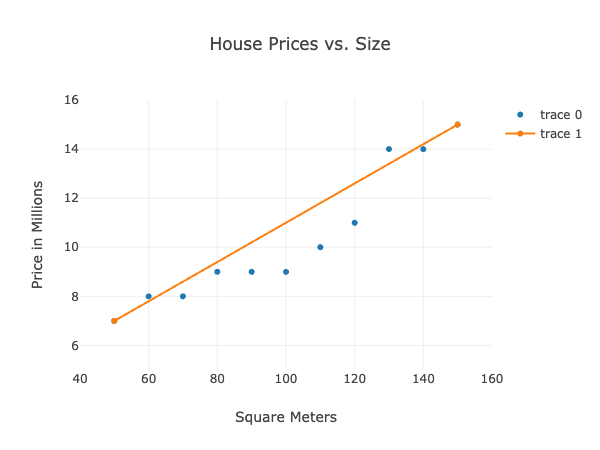

## Predicting house prices with machine learning - a theoretical workflow

Ludwig Carlegrund - AI24

---
#### Linear regression

To begin with and to be able to understand the document in full, i will begin with explaining the algorithm used. Linear regression is a supervised machine learning algorithm which is used to learn and make predictions on data. The algorithm models the **relationship between** one or several **variables**, in this case its the relationship between house pricing and several different "features",which in our case would be house size, number of rooms, location etc. 
Linear regression is one of the most well known and used algorithms in ML because of its familiarity(statistics) simplicity, and the time it takes to train. 

#### Data collection
the first and probably the most important step to a good machine learning model is gathering high quality data - the better the data, the better the model.
There's a number of sources and methods to gather data. A few examples include public databases such as the swedish scb (statistiska centralbyrån), or huggingface, which is an AI community for collaborating on models, datasets etc. And gathering data yourself would be done by webscraping websites such as, in our example: hemnet, booli, blocketbostad etc. Private datasets might also be provided by an employer.

after gathering data it's important to structure it in a table format with a column for each variable, which then is either saved into a csv file or put into a database such as sql

#### Data processing

the collected data is usually raw, before it can be used in a model it needs to be processed and prepared. this includes handling missing data points, which can either be filled in, usually with a median or by just deleting the row.
Categorized variables such as for e.g location need to be converted into a numerical format, since machine learning models only can handle numerical formats.

last but not least, because linear regression uses euclidean distance calculations, which is sensitive to the _scale_ of variables, it's also helpful to scale the data so that no single variable dominates the distance calculations, this is often done by techniques such as standardization, normalization, or min-max scaling.

#### Vizualising data

before training a model it's good practice to visualize the data to understand the relationship between variables. It can also aid in recognizing patterns and deviations that are important for the model

this is usually done using the matplotlib or seaborn modules in python
an example would be using a scatterplot to visualize the relationship between house size and price.

 [example of a visualization | source: w3schools](https://www.w3schools.com/ai/ai_regressions.asp)

#### Building the model
At this point the data is split into 3 sets, training, validation and testing data. The ratio between these sets vary depending on project. after training our model we need to validate and evaluate and then proceed with any fine-tuning until the results provided by the model fit the expectations

#### deploying an AI-model

in terms of how and where to deploy an AI model will depend on the desired use-case. The model could be put on the cloud but putting it in a docker container, And by utilizing python modules such as flask, django, or fastAPI would let users communicate with it. These are so called REST API frameworks. These API's can then be deployed on the cloud such as azure. 

---

_this explanation is quite summarized and generalized since going into too much of the details into any of this would require more than 500 words_

---

#### Sources
[kdnuggets](https://www.kdnuggets.com/2018/12/machine-learning-project-checklist.html) - general workflow
[towards data science](https://towardsdatascience.com/workflow-of-a-machine-learning-project-ec1dba419b94) - general workflow
[w3schools](https://www.w3schools.com/ai/ai_regressions.asp) - linear regression (visualization)
[geeksforgeeks](https://www.geeksforgeeks.org/ml-linear-regression/#what-is-linear-regression) linear regression
[machinelearningmastery.com](https://machinelearningmastery.com/linear-regression-for-machine-learning/) linear regression
[stackoverflow](https://stackoverflow.blog/2020/10/12/how-to-put-machine-learning-models-into-production/) - how to put a model into production
[medium](https://moez-62905.medium.com/easily-deploy-machine-learning-models-from-the-comfort-of-your-notebook-9068a88f4cf5) - how to deploy a model
  *& my memory from the countless of youtube videos i've watched on the subject thus far*